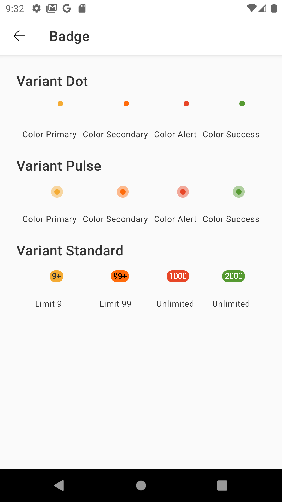

# Badge Component

#### Note:

This component is available in the following variants:

* ✅ Dot
* ✅ Pulse
* ✅ Standard

With the following attribute status:

* Color(All Variants):
    * ✅ `Alert` (default)
    * ✅ `Primary`
    * ✅ `Secondary`
    * ✅ `Success`
    
* Limit(Standard):
    * ✅ `9`
    * ✅ `99`
    * ✅ `Unlimited` (default)
    
* isFontWeight(Standard):
    * ✅ `true`
    * ✅ `false` (default)
      
## What is it?

The Badge is a screen element used to signal the user's points of attention.
Represents dynamic information such as number of notifications unread with some styles to match Nat DS appearance.

### Why should I use it?

This component can help you to display some simple information on the top of chosen drawable.

### When should I use it?

Every time you want to display an component with a badge

### How to use it?

#### Badge Drawable

We use BadgeDrawable class to draw this component on screen. 
For that to happen, it is necessary to instantiate the BadgeDrawable class, passing three parameters: 

1. context application
2. number that will be drawn, when the variant is standard
3. the drawable that will receive the badge
4. background color 
3. numerical limit, when the variant is standard
        
#### Examples

##### If you want to display an icon with a Badge with number

* Create a drawable layer-list with two items inside. The first item should be your base icon and the second should be the placeholder for your badge.

```android
 icon_base_badge.xml
 
<layer-list xmlns:android="http://schemas.android.com/apk/res/android">
    <item
        android:drawable="@drawable/outlined_default_mockup"
        android:gravity="center" />

    <item
        android:id="@+id/ic_badge_placeholder"
        android:drawable="@android:color/transparent" />
</layer-list>

   ```

* Use icon_base_badge.xml as your ImageView source.

* Create a new instance of BadgeDrawable passing the context, the number that you want to be displayed and the image will be inflated with Badge.

```kotlin
    val badgeDrawable: BadgeDrawable

    override fun onCreate(savedInstanceState: Bundle?) {
        super.onCreate(savedInstanceState)
        setContentView(R.layout.activity_badge)
        badgeDrawable = BadgeDrawable(this, number, imageViewBadged.drawable)
    }
   ```

* If you need to update the number inside a Badge, call the method 'updateNotificationBadge'
```android
   badgeDrawable.updateBadgeDrawable(number)
   
   ```

#### Badge

We use Badge class to draw this component on screen, as a pre-defined visual component, ready to be inserted into a layout. 
For that to happen, it is necessary add the Badge component in your xml layout file. It has some parameters: 

 1. badgeColor
 2. badgeLimitNumber
 3. badgeNumber
 4. badgeVariant
        
#### Example

```android
<com.natura.android.badge.Badge
        android:id="@+id/badgeDotColorPrimary"
        android:layout_width="wrap_content"
        android:layout_height="wrap_content"
        app:badgeColor="colorPrimary"
        app:badgeVariant="dot" />
</com.natura.android.card.Card>
```



