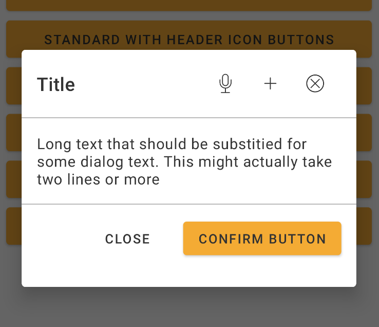
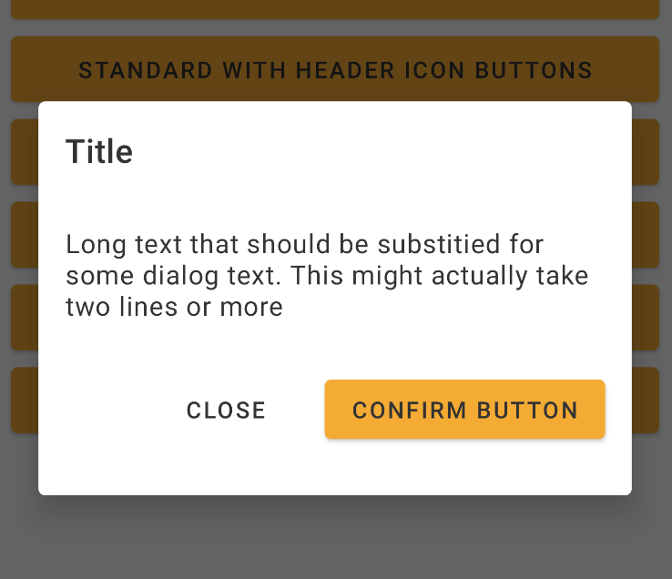
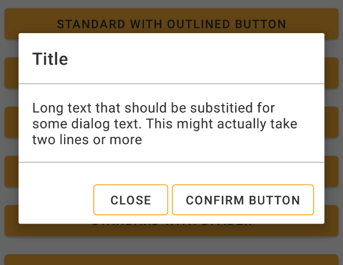

# Dialog
Dialogs inform users about a task and can contain critical information, require decisions, or involve multiple tasks.

Built based on [AlertDialog](https://developer.android.com/reference/android/app/AlertDialog).


## Note for Design:

This component is available in the following variants:

- ✅ **`Alert`**
- ✅ **`Standard`**

With the following attribute status:

- Divider(Standard):

  - ✅ False (default)
  - ✅ True
- ✅ firstHeaderIconButton (Standard)
- ✅ firstHeaderIconButtonAction (Standard)
- ✅ secondHeaderIconButton (Standard
- ✅ secondHeaderIconButtonAction (Standard)
- ✅ thirdHeaderIconButton (Standard)
- ✅ thirdHeaderIconButtonAction (Standard)
- ❌ Size / Height
- ❌ Scroll


## Attributes
| Attrs | Description | Type | Options |
| - | --- | -------------| :------: |
| Context | Android Context | Context | - 
| Dialog Title | String that will be show as a dialog title | string | text
| Dialog Main Button Title (Optional) | String with main button's label, this button will be show as a *contained* button | string | text
| Dialog Main Action (Optional) | DialogInterface.OnClickListener that will be call when user perform a click at main button | Listener | Listener
| Dialog Secondary Button Title (Optional) | String with secondary button's label, this button will be show as a *text* button | string | text
| Dialog Secondary Action (Optional) | DialogInterface.OnClickListener that will be call when user perform a click at secondary button|  Listener | Listener
| Content View, Content Layout or Text Message | Content that will be show inside dialog. You can provide an View, a Layout reference to fill it, or simply insert the main text of your dialog. | XML, View or string | - 
| Cancelable | Flag that set if dialog can be closed by clicking out of it or not. You can omite this parameter and it will be assumed as true | boolean | true or false
| Dialog Theme (Optional) | If the view where dialog is in has not a DS theme applyed, you can pass the DS theme reference at the constructor. The theme will be used only inside the dialog. <p>⚠️ **If you omit this, the parent theme will be used to set the dialog. If the parent theme is not an Nat DS Theme, the dialog will not be set as expected**</P> | Android theme | - 
| Divider (Optional)  | Flag that defines whether two division lines will separate the content (top and bottom) | boolean | true or false
| StyleButtons (Optional)  | Constant that indicates whether the buttons will have default style (Main and Secondary), Contained, Text or Outlined. | integer | - 
| firstHeaderIconButton (Optional)  | String used to define the icon of the first iconbutton of the dialog header | string | Icon name
| firstHeaderIconButtonAction (Optional)  | View.OnClickListener that will be call when user perform a click at first iconbutton in header | Listener | Listener
| secondHeaderIconButton (Optional)  | String used to define the icon of the second iconbutton of the dialog header | string | icon name
| secondHeaderIconButtonAction (Optional)  | View.OnClickListener that will be call when user perform a click at second iconbutton in header | Listener | Listener
| thirdHeaderIconButton (Optional)  | String used to define the icon of the third iconbutton of the dialog header | string | icon name
| thirdHeaderIconButtonAction (Optional)  | View.OnClickListener that will be call when user perform a click at third iconbutton in header | Listener | Listener


## Usage Examples

Dialog with icon, dividers, icon buttons and text



#### Kotlin

```android
private fun createStandardDialogWithHeaderIconButtons() {
        val mainClickListener = DialogInterface.OnClickListener { _, _ ->
            Toast.makeText(
                this,
                "Dialog Main Action",
                Toast.LENGTH_LONG
            ).show()
        }
        val secondaryClickListener = DialogInterface.OnClickListener { _, _ ->
            Toast.makeText(
                this,
                "Dialog Secondary Action",
                Toast.LENGTH_LONG
            ).show()
        }

        val firstHeaderAction = View.OnClickListener {
            Toast.makeText(this, "Dialog Header Icon Action", Toast.LENGTH_LONG).show()
        }
        val secondHeaderAction = View.OnClickListener {
            Toast.makeText(this, "Dialog Header Icon Action", Toast.LENGTH_LONG).show()
        }
        val thirdHeaderAction = View.OnClickListener {
            Toast.makeText(this, "Dialog Header Icon Action", Toast.LENGTH_LONG).show()
        }

        standardDialogHeaderIconButtons = DialogStandard(
            this,
            "Title",
            "Confirm Button",
            mainClickListener,
            "Close",
            secondaryClickListener,
            "Long text that should be substitied for some dialog text. This might actually take two lines or more",
            true,
            null,
            false,
            0,
            "outlined-action-mic",
            firstHeaderAction,
            "outlined-action-add",
            secondHeaderAction,
            "outlined-action-cancel",
            thirdHeaderAction
        ).create()
    }
```

Dialog with title, text and two buttons only



#### Kotlin

```android
private fun createDialog() {
    val mainClickListener = DialogInterface.OnClickListener { _, _ -> Toast.makeText(this, "Dialog Main Action", Toast.LENGTH_LONG).show() }
    val secondaryClickListener = DialogInterface.OnClickListener { _, _ -> Toast.makeText(this, "Dialog Secondary Action", Toast.LENGTH_LONG).show() }

    dialogStandard = DialogStandard(
        this,
        "Title",
        "Confirm Button",
        mainClickListener,
        "Close",
        secondaryClickListener,
        "Long text that should be substitied for some alert text. This might actually take two lines or more").create()
}
```

Dialog with title, text, dividers and outlined buttons



#### Kotlin

```android
private fun createDialog() {
        val mainClickListener = DialogInterface.OnClickListener { _, _ ->
            Toast.makeText(
                this,
                "Dialog Main Action",
                Toast.LENGTH_LONG
            ).show()
        }
        dialogStandard = DialogStandard(
            this,
            "Title",
            "Confirm Button",
            mainClickListener,
            "Close",
            null,
            "Long text that should be substitied for some dialog text. This might actually take two lines or more",
            true,
            null,
            true,
            DialogStandard.OUTLINED
        ).create()
    }
```

Showing the dialog

With the dialog created, you can show it whenever you want, calling *show()* method :)

```android
button.setOnClickListener {
    dialogStandard.show()
}
```

#### Dialog Standard from Dialog Fragment

We also allow the use of DialogStandard extending from DialogFragment, in order to aggregate the
life cycle of a fragment to some development need.

Instead of sending callbacks as a parameter, the class that will use the DialogStandardFragment will
need to implement the DialogStandardFragmentCallback interface, where the button click methods are.
Below is an example of how to use it:

```android
val fragmentManager: FragmentManager = supportFragmentManager
val alertDialog: DialogStandardFragment = DialogStandardFragment.newInstance("Some title", "Some text", "OK", "Cancel")
alertDialog.show(fragmentManager, "DialogFragment")
```

```android
class DialogActivity : AppCompatActivity(), DialogStandardFragmentCallback {
    .
    .
    .
    .
    
    override fun onMainButtonClick() {
        Toast.makeText(
            this,
            "Dialog Main Action",
            Toast.LENGTH_LONG
        ).show()
    }

    override fun onSecondaryButtonClick() {
        Toast.makeText(
            this,
            "Dialog Secondary Action",
            Toast.LENGTH_LONG
        ).show()
    }
}
```


