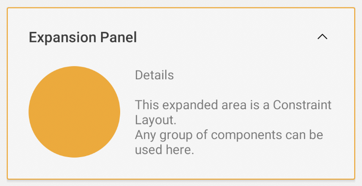

# Expansion Panel

### What is it?
Expansion Panel is a component to display a title when collapsed and
can have any other component inside it. This other component can be
displayed when Expansion Panel is opened.

### How to use it?
Expansion Panel receives a title (string type) attribute. It can have
any type of child that will be rendered inside collapsed area.

Following there's an example of an Expansion Panel with an LinearLayout
and TextField children:

```android
<com.natura.android.expansionPanel.ExpansionPanel
    android:layout_width="match_parent"
    android:layout_height="wrap_content"
    app:title="Expansion Panel">

    <LinearLayout
        android:id="@+id/circle_example"
        android:layout_width="100dp"
        android:layout_height="100dp"
        android:background="@drawable/ds_border_circle"
        android:orientation="vertical"
        android:layout_gravity="center"
        app:layout_constraintBottom_toBottomOf="parent"
        app:layout_constraintTop_toTopOf="parent"
        app:layout_constraintLeft_toLeftOf="parent"/>

    <TextView
        android:id="@+id/text_example"
        android:layout_width="0dp"
        android:layout_height="wrap_content"
        android:text="Details\n\nThis expanded area is a Constraint Layout.\nAny group of components can be used here."
        android:layout_marginTop="0dp"
        android:layout_marginLeft="?spacingSmall"
        app:layout_constraintBottom_toBottomOf="parent"
        app:layout_constraintTop_toTopOf="parent"
        app:layout_constraintRight_toRightOf="parent"
        app:layout_constraintLeft_toRightOf="@id/circle_example"/>

</com.natura.android.expansionPanel.ExpansionPanel>
```
### How it looks like

#### Collapsed:
[](https://postimg.cc/gX4JPZfR)

#### Opened:
[](https://postimg.cc/kR45M5mH)

### How to handle state

You can get or set the ExpansionPanel's current state by using the `isExpanded` attribute.

```kotlin
fun expandFirstExpansionPanel() {
    val expansionPanel = findViewById<ExpansionPanel>(R.id.first_expansion_panel)
    expansionPanel.isExpanded = true
}

val expansionPanel = findViewById<ExpansionPanel>(R.id.second_expansion_panel)
val secondExpansionPanelState = if (secondExpansionPanel.isExpanded) "expanded" else "collapsed"
```

Set a `OnStateChangeListener` if you need to be notified when the state changes.

```kotlin
val expansionPanel = findViewById<ExpansionPanel>(R.id.expansion_panel)

expansionPanel.setOnStateChangeListener { isExpanded ->
    // isExpanded is the current state of the ExpansionPanel.
}
```
