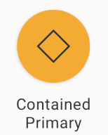

# Shortcut
Shortcut is a component that represents a shortcut to some action.   
Extends from [ConstraintLayout](https://developer.android.com/reference/androidx/constraintlayout/widget/ConstraintLayout).


| _Created: 2.3.0_ <br> _Last updated (With Breaking Change): 9.0.0_ |
| ----- | 


## Attributes
| Attr | Description | Type | Options |
| - | --- | --- | --- |
|`app:shct_type`|  Defines the type of the component's background.| string | - **contained**: background is filled <br> - **outlined**: the component is just outlined <br> |
|`app:shct_text_label`| Sets the label of component.| string | text
|`app:shct_icon_name`| Defines the name of the icon that will be shown in the center of the component. | string | text
|`app:shct_notify`| Sets the number showed by notification at Shortcut | integer | When 0, notification is not visible, limit is 10000. |

## Usage Examples
Shortcut with mockup icon, type contained and notify



#### Layout XML

```android
    <com.natura.android.shortcut.Shortcut
        android:id="@+id/shortcut"
        android:layout_width="wrap_content"
        android:layout_height="wrap_content"
        app:shct_icon_name="outlined-default-mockup"
        app:shct_notify="1000"
        app:shct_text_label="Contained/Primary"
        app:shct_type="contained" />
```

#### Kotlin

```kotlin
    val shortcut = findViewById<Shortcut>(R.id.shortcut)
    shortcut.notify = 1000
    shortcut.setLabel("Contained/Primary")
    shortcut.setIcon("outlined-default-mockup")
```
<br><br>
Shortcut with mockup icon, type outlined and action


#### Layout XML

```android
    <com.natura.android.shortcut.Shortcut
        android:id="@+id/shortcut"
        android:layout_width="wrap_content"
        android:layout_height="wrap_content"
        app:shct_icon_name="outlined-default-mockup"
        app:shct_text_label="Outlined/Primary"
        app:shct_type="outlined" />
```

#### Kotlin

```kotlin
    val shortcut = findViewById<Shortcut>(R.id.shortcut)
    shortcut.setLabel("Outlined/Primary")
    shortcut.setIcon("outlined-default-mockup")

    shortcut.setOnClickListener {
        Toast.makeText(this, "Testing shortcut", Toast.LENGTH_SHORT).show()
    }
```

<br>

## Light mode / Dark mode

<p align="center">
   
&nbsp;
  
</p>

## More code
You can check out more examples from SampleApp by clicking [here](../sample/src/main/res/layout/activity_shortcut.xml).

## Attention points

1. Before the **3.0.0** version, the parameter to set the shortcut icon is different <br>
    - Attribute name: icon  
    - Parameter type: drawable

    Ex: `app:icon="@drawable/outlined_default_mockup"`

<br>


2. A shortcut is a DS component based on DS **multibrand themes**. It means if you want to use a shortcut in your app, you MUST set the DS theme on a view parent or in the shortcut component itself. [Check more info about how to set DS themes in your app](getting-started.md).